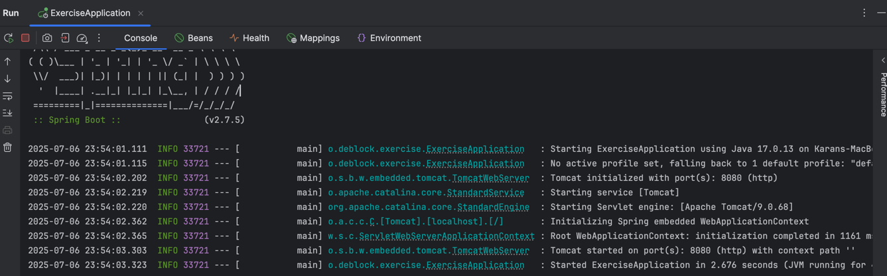
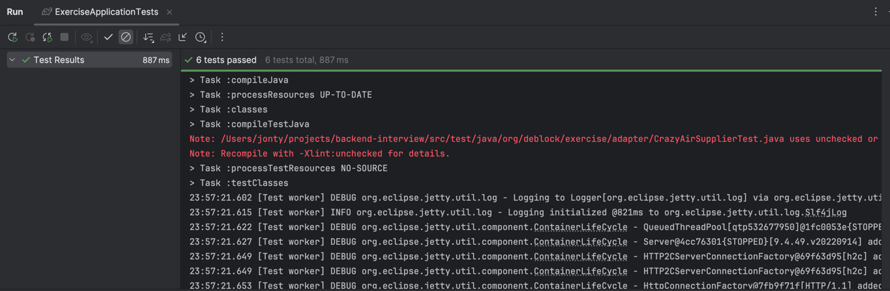
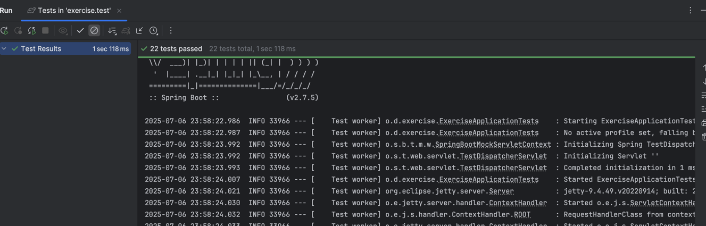

**Deblock - Problem to be solved**

**My approach and notes:**

Looking at the key requirements to get flight details from external suppliers and combine them as a response through the `/flights` api, 
this implementation includes the following:
- I have created all the supplier adapters and their DTO in an single directory to separate out their implementations. This ensures modularity and future extensibility (Therefore adding new suppliers).
- All supplier (crazyAir, Toughjet or any new supplier) are injected in the main service layer/port (SearchFlightService) using spring dependency injection (therefore we do not have to update service layer if a new supplier is added, following SOLID principles)
- Both the supplier class converts supplier DTO response to domain DTO (`FlightResponse`). I was thinking to keep mapping logic separate but for simplicity of this test kept it in the same class. 
- The Service layer `SearchFlightService` (like usage in Hexagonal arch), gets all the supplier response in an asyc response and combine them before sorting based on fare.
- Since hexagonal architecture pattern was new to me, I had a look and tried following the same structure, though some of my file structure looks like MVC pattern.
- Implemented two exceptions - one for supplier exceptions nd other for service exceptions. Main endpoint (service layer) would only use service exception.
- Inputs are validated using annotations, keeping the contract strict

***Testing***
- Have used wiremock for all the tests
- `ExerciseApplicationTests` simulates real-world scenarios using mocked external APIs on ports 8001 and 8002. (chose similar port number as service run)
Ensures the application behaves correctly when:
  1. One or both suppliers return flights
  2. No flights are available
  3. all supplier returns error
  4. Invalid input sent
- Test are also implemented for each adapter class to test and stimulate supplier response and testing mapper conversion.
- Controller tests are also added to test controller in isolation

***Future work:***

Few suggestions I would implement for a production based code
- Move mapper logic in a separate class (maybe use library like mapstruct, as most of the domain names are similar and basic computation was required for tough jet)
- Implement Cucumber tests as an alternative for integration tests and acceptance tests
- Read more about hexagonal arch and implement it better
- Maybe look further into exception handling (kept it very simple for now)
- Implement test reports like jacoco to enforce test coverage
- Implement lint or other library for enforcing coding and import standards

Test evidence: 
- Application stating up 
- Test run (integration test) 
- All tests running 
-----------------------------------------
**Background:**
DeblockFlights is a flights search solution which aggregates flight results initially from 2 different suppliers (CrazyAir and ToughJet). A future iteration (not part of the test) may add more suppliers.

**What is required:**

Hexagonal architecture is preferred, but not mandatory: https://www.baeldung.com/hexagonal-architecture-ddd-spring
Kotlin is what we use.

Use this GitHub repository as a base to implement the Deblock Flights service that should produce an aggregated result from both CrazyAir and ToughJet.
The result should be a JSON response which contains a list of flights ordered by fare which has the following attributes:

**Deblock Flights API**

**Request**

| Name | Description |
| ------ | ------ |
| origin | 3 letter IATA code(eg. LHR, AMS) |
| destination | 3 letter IATA code(eg. LHR, AMS) |
| departureDate | ISO_LOCAL_DATE format |
| returnDate | ISO_LOCAL_DATE format |
| numberOfPassengers | Maximum 4 passengers |

**Response**

| Name | Description |
| ------ | ------ |
| airline | Name of Airline |
| supplier | Eg: CrazyAir or ToughJet |
| fare | Total price rounded to 2 decimals |
| departureAirportCode | 3 letter IATA code(eg. LHR, AMS) |
| destinationAirportCode | 3 letter IATA code(eg. LHR, AMS) |
| departureDate | ISO_DATE_TIME format |
| arrivalDate | ISO_DATE_TIME format |

The service should connect to the both the suppliers using HTTP.

**CrazyAir API**

**Request**

| Name | Description |
| ------ | ------ |
| origin | 3 letter IATA code(eg. LHR, AMS) |
| destination | 3 letter IATA code(eg. LHR, AMS) |
| departureDate | ISO_LOCAL_DATE format |
| returnDate | ISO_LOCAL_DATE format |
| passengerCount | Number of passengers |

**Response**

| Name | Description |
| ------ | ------ |
| airline | Name of the airline |
| price | Total price |
| cabinclass | E for Economy and B for Business |
| departureAirportCode | Eg: LHR |
| destinationAirportCode | Eg: LHR |
| departureDate | ISO_LOCAL_DATE_TIME format |
| arrivalDate | ISO_LOCAL_DATE_TIME format |

**ToughJet API**

**Request**

| Name | Description |
| ------ | ------ |
| from | 3 letter IATA code(eg. LHR, AMS) |
| to | 3 letter IATA code(eg. LHR, AMS) |
| outboundDate |ISO_LOCAL_DATE format |
| inboundDate | ISO_LOCAL_DATE format |
| numberOfAdults | Number of passengers |

**Response**

| Name | Description |
| ------ | ------ |
| carrier | Name of the Airline |
| basePrice | Price without tax(doesn't include discount) |
| tax | Tax which needs to be charged along with the price |
| discount | Discount which needs to be applied on the price(in percentage) |
| departureAirportName | 3 letter IATA code(eg. LHR, AMS) |
| arrivalAirportName | 3 letter IATA code(eg. LHR, AMS) |
| outboundDateTime | ISO_INSTANT format |
| inboundDateTime | ISO_INSTANT format |

**What you need to provide:**

- A solution that meets the above requirements.
- Clean code using OO design principles
- Ensure the code is extensible to multiple suppliers.
- There is no need to complete the 100% of the exercise, as long as you show that you are in the right path, you solution is scalable, the testing is good and that you understand OO principles we will be happy.

- Use the Streams
- Good use of Spring annotations and use of Spring Boot, Spring MVC, and Spring Data
- Use of ControllerAdvice (or equivalent) for error handling

- Implement good unit testing, there is no need for 100% coverage, we want to check your unit testing practices
- At least one Spring integration tests, the full happy path. Mock suppliers responses using wiremock, or just mock the method when the supplier retrieves data.

**Bonus:**
- Please show an appreciation for Parallelism
- Ensure there is request validation
- Good use of interfaces. e.g. Supplier hidden behind an interface so adding a new supplier should be relatively easy
  
**Don't do:**
- Do NOT over-engineer your solution; keep it simple!

**Note**

Please clone this project then create your own repository from it. Do not fork/branch this project when creating your solution as it will be visible to other applicants.
